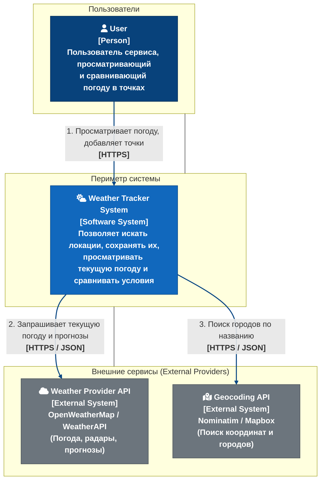
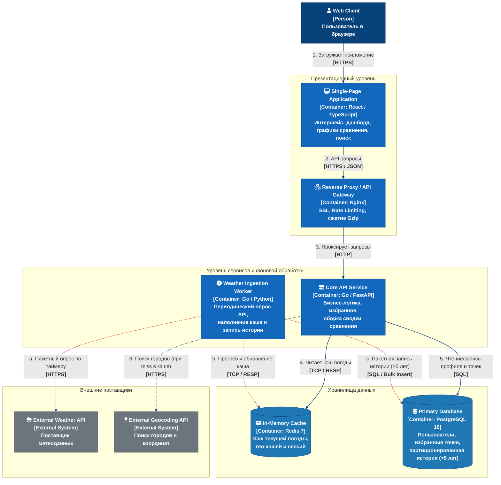
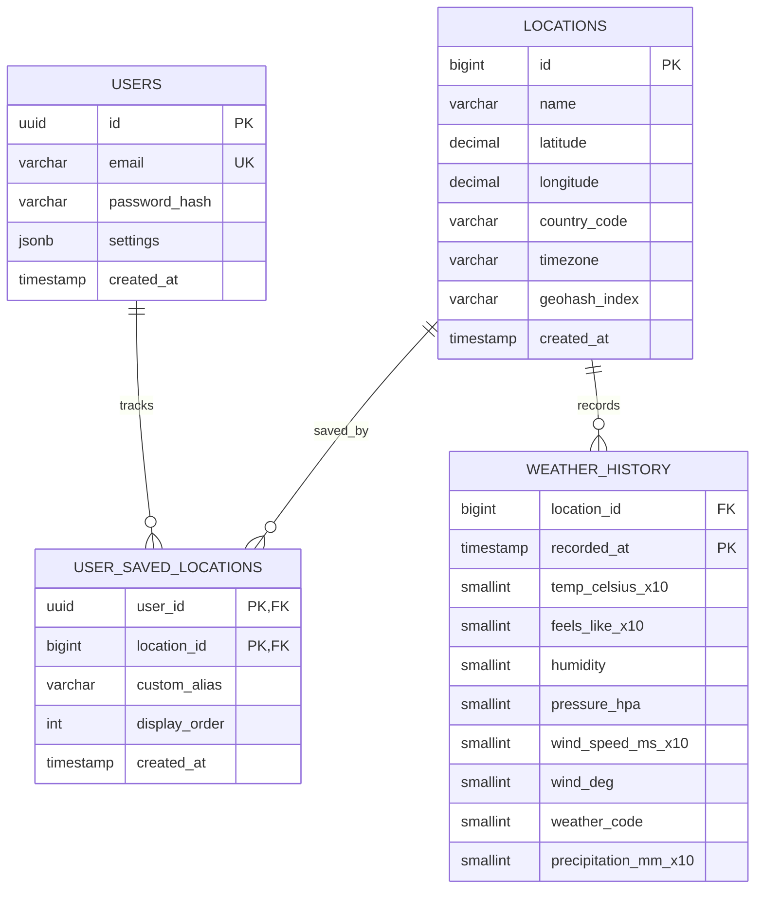
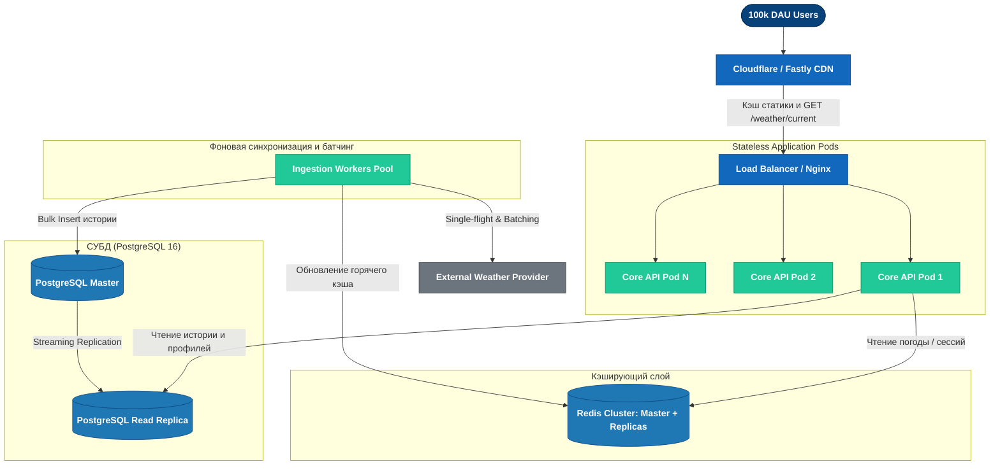

# Трекер погоды

Backend: Golang  

Frontend: Веб-приложение (React SPA)  

База данных: PostgreSQL 

Кэширование: Redis

Внешний API: Open-Meteo Weather API ([https://open-meteo.com/](https://open-meteo.com/))

Ограничения API: 10000 API calls per day, 5000 per hour and 600 per minute

## Требования
### Пользовательские сценарии (User Stories)

**User Story 1: Сравнение погоды в нескольких городах для планирования поездки**  
Как пользователь, который часто планирует поездки и командировки, я хочу видеть и сравнивать текущую погоду и краткосрочный прогноз сразу для нескольких выбранных городов на одном экране, чтобы за пару минут решить, куда поехать и какую одежду взять.  
**Критерии приёмки**:
- Пользователь может добавить в список до 5 городов одновременно.
- Для каждого города отображаются текущая погода и прогноз погоды.
- Данные обновляются автоматически не реже одного раза в 5 минут.
- Пользователь может удалить город из списка.

**User Story 2: Выбор лучших мест для виндсерфинга по погодным условиям**  
Как любитель виндсерфинга, я хочу удобно получать информацию сразу о нескольких точках катания, чтобы выбрать наилучшую с точки зрения скорости, направления ветра, температуры, облачности, осадков и т.д.  
**Критерии приёмки**:
- Возможность задать несколько интересующих точек
- Удобный просмотр погодных условий, направление ветра указывается стрелочками на карте, а не просто ЮЗ, С, СВ и тд.
- Сортировка точек по разным параметрам (скорость ветра, температура, осадки)

**User story 3. Планирование подходящего времени для спортивной активности**  
Как житель города, который занимается спортивной активностью на улице, я хочу получать рекомендацию лучших временных окон для прогулки или тренировки, чтобы выбрать подходящее время без ручного анализа всех погодных параметров.
**Критерии приёмки**:
- Пользователь может выбрать город, дату и тип активности (например, бег).
- Для активности можно задать подходящие условия: диапазон температуры, максимальную вероятность осадков и максимальную скорость ветра.
- Система анализирует почасовой прогноз.
- В результате система предлагает один или несколько подходящих временных интервалов.
- Для каждого интервала отображаются причины рекомендации: температура, вероятность осадков и скорость ветра.
- Если подходящего интервала нет, система сообщает об этом и показывает наиболее близкий вариант.
- Рекомендация формируется только на основе актуальных данных прогноза.

## Масштаб системы и оценка нагрузки
**Целевой масштаб:** от 10 000 уникальных пользователей в сутки (DAU).

В среднем каждый пользователь совершает 10–14 запросов в сутки (получение текущей погоды и прогноза, сравнение погоды в разных городах, добавление/удаление города, запрос рекомендации).

Суточный объем пользовательских запросов к системе: 10 000 * 12 = 120 000 запросов в сутки

Дополнительно автообновление: при 500 активных онлайн-пользователей и обновлении раз в 5 минут:  
500 × (60/5) = 6 000 запросов в час в пике, что эквивалентно ~1,67 req/s.

**Расчет RPS (Requests Per Second):**

- Средний дневной RPS: 
RPS_avg = 120 000 / 86 400 = 1,33 req/s.
- Пиковый RPS:
Для погодного сервиса характерны утренние (07:00–09:00) и вечерние (17:00–19:00) часы, на которые приходится до 60% суточного трафика.
RPS_peak = 72 000 / (4 × 3600) = 5 req/s.
- С учетом автообновления в пике:  
RPS_peak_total ≈ 5 + 1,33 = 6,33 req/s.

## Разработка архитектуры и детальное проектирование
## 1. Анализ нагрузок (Capacity Planning)

### 1.1. Базовые вводные данные и сценарии поведения
* **DAU (Daily Active Users):** 10 000 уникальных пользователей в сутки.
* **Паттерн использования:**
  * Среднее количество сессий на пользователя: **2 сессии в день** (утром и вечером).
  * Среднее количество отслеживаемых точек на пользователя: **4 локации**.
  * Просмотр дашборда (сравнение всех точек): 2 раза за сессию.
  * Редактирование списка точек (добавление/удаление): редкое действие — 1 раз в 10 дней на пользователя (в среднем 0.1 Write-запроса на пользователя в день).
  * Справочник уникальных сохраненных локаций (с учетом пересечений городов между пользователями): оценочно 3 000 – 5 000 уникальных гео-точек.

### 1.2. Расчет соотношения Read/Write нагрузки (RPS / WPS)

#### Пользовательская нагрузка (User Facing):
1. **Read-запросы (чтение текущей погоды, прогнозов и сравнение):**
   * Запросов в сутки: $10\,000 \text{ польз.} \times 2 \text{ сессии} \times 2 \text{ обновления} = 40\,000 \text{ запросов/сутки}$.
   * Запросы автодополнения поиска (Geocoding/Search): $\approx 10\,000 \text{ запросов/сутки}$.
   * Итого Read: $\approx 50\,000 \text{ запросов/сутки}$.
   * **Средний Read RPS:** $50\,000 / 86\,400 \approx 0.6 \text{ RPS}$.
   * **Пиковый Read RPS (с коэффициентом неравномерности $k=3$):** $0.6 \times 3 \approx \mathbf{1.8 \text{ RPS}}$ (до 5 RPS в утренние часы пик).

2. **Write-запросы от пользователей (добавление/удаление точек, смена настроек):**
   * Запросов в сутки: $10\,000 \times 0.1 = 1\,000 \text{ запросов/сутки}$.
   * **User Write RPS:** $\approx \mathbf{0.01 \text{ WPS}}$ (пренебрежимо мало).

#### Фоновая системная нагрузка (Ingestion / Background Writes):
Для хранения 5-летней истории сервис периодически опрашивает и сохраняет исторические срезы по активным уникальным локациям (1 раз в час для 5 000 точек):
* Фоновых записей в БД: $5\,000 \text{ локаций} \times 24 \text{ часа} = 120\,000 \text{ записей/сутки}$.
* **Background Write RPS:** $120\,000 / 86\,400 \approx \mathbf{1.4 \text{ WPS}}$.

#### Итоговое соотношение Read / Write:
* Соотношение пользовательских запросов к API: **Read : Write $\approx$ 50 : 1**.
* С учетом регулярной фоновой записи в БД: суммарная нагрузка на СУБД сбалансирована ($\approx 2 \text{ RPS}$ на чтение против $\approx 1.4 \text{ WPS}$ на пакетную запись).

### 1.3. Расчет объемов сетевого трафика

* **Read Payload (исходящий трафик пользователю):**
  * Сводная сводка по 4 точкам (текущие условия + прогноз на 3 дня): $\approx 8 \text{ КБ}$ JSON ($\approx 2.5 \text{ КБ}$ с gzip-сжатием).
  * Суточный объем исходящего трафика (Egress): $50\,000 \times 2.5 \text{ КБ} \approx \mathbf{125 \text{ МБ/сутки}}$.
  * Пиковая полоса пропускания: $5 \text{ RPS} \times 2.5 \text{ КБ} \approx \mathbf{12.5 \text{ КБ/с}}$ ($\approx 0.1 \text{ Мбит/с}$).

* **Ingress Payload (входящий трафик от внешнего Weather API):**
  * Срез погоды на одну локацию: $\approx 4 \text{ КБ}$.
  * Суточный объем внешних запросов: $120\,000 \times 4 \text{ КБ} \approx \mathbf{480 \text{ МБ/сутки}}$.

### 1.4. Расчет объемов дисковой системы (хранение $> 5$ лет)

#### А. Пользовательские данные:
* 10 000 пользователей $\times 1 \text{ КБ}$ (профиль + связи) $\approx 10 \text{ МБ}$.

#### Б. Исторические погодные данные (Time-Series Data в стандартном PostgreSQL):
* Шаг фиксации: 1 срез в час для каждой точки.
* Количество уникальных локаций: $5\,000$.
* Количество записей в год: $5\,000 \text{ локаций} \times 24 \times 365 = 43\,800\,000 \text{ записей/год}$.
* За 5 лет: $43.8 \text{ млн} \times 5 = \mathbf{219\,000\,000 \text{ строк}}$.
* Размер одной строки в таблице PostgreSQL (с учетом выравнивания полей и заголовка кортежа tuple header в 24 байта): $\approx 64 \text{ байта}$.
* Объем сырых данных таблицы за 5 лет: $219 \times 10^6 \times 64 \text{ байта} \approx \mathbf{14.0 \text{ ГБ}}$.
* Индексы (локальный составной B-Tree на каждой партиции `(location_id, recorded_at)`): $\approx \mathbf{12.0 \text{ ГБ}}$.
* **Итого объем базы данных за 5 лет:** $\approx \mathbf{26 \text{ ГБ}}$.
* **Рекомендуемый объем диска:** с учетом запаса под WAL-логи (Write-Ahead Logging), временные файлы автовакуума (VACUUM/ANALYZE) и резервные копии рекомендуется диск SSD объемом 80 – 100 ГБ. Это полностью и с запасом закрывает пятилетний горизонт без потребности в сторонних расширениях.


## 2. Архитектурные схемы (C4 Model)

### 2.1. Level 1: System Context Diagram



### 2.2. Level 2: Container Diagram



---

## 3. Контракты API

Формат взаимодействия: **REST over HTTPS**, тело запросов и ответов в **JSON**.

### 3.1. Спецификация эндпоинтов и SLA по задержкам

| Метод | Путь | Описание | Latency p95 | Latency p99 |
|---|---|---|---|---|
| `GET` | `/api/v1/locations/search?q={query}` | Поиск городов и координат по названию | $< 150 \text{ ms}$ | $< 300 \text{ ms}$ |
| `GET` | `/api/v1/users/me/locations` | Получение сохраненных точек пользователя | $< 30 \text{ ms}$ | $< 60 \text{ ms}$ |
| `POST` | `/api/v1/users/me/locations` | Добавление новой точки в отслеживаемые | $< 50 \text{ ms}$ | $< 100 \text{ ms}$ |
| `DELETE` | `/api/v1/users/me/locations/{id}` | Удаление точки из отслеживаемых | $< 30 \text{ ms}$ | $< 60 \text{ ms}$ |
| `GET` | `/api/v1/weather/current?location_ids=1,2` | Получение текущей погоды для выбранных точек | $< 40 \text{ ms}$ (из Redis) | $< 80 \text{ ms}$ |
| `GET` | `/api/v1/weather/compare?location_ids=1,2&days=3` | Сводные данные для экрана сравнения | $< 60 \text{ ms}$ (из Redis) | $< 120 \text{ ms}$ |
| `GET` | `/api/v1/weather/history?location_id=1&from=...&to=...` | Исторические данные за интервал (до 5 лет) | $< 150 \text{ ms}$ (из БД) | $< 350 \text{ ms}$ |

### 3.2. Примеры запросов и ответов

#### 1. Получение текущей погоды по точкам:
`GET /api/v1/weather/current?location_ids=101,202`

```json
{
  "timestamp": "2026-03-30T10:00:00Z",
  "items": [
    {
      "location_id": 101,
      "name": "Berlin",
      "country": "DE",
      "temperature": 14.2,
      "feels_like": 13.0,
      "humidity": 65,
      "wind_speed": 4.1,
      "condition": "Cloudy",
      "icon": "cloudy_day"
    },
    {
      "location_id": 202,
      "name": "Madrid",
      "country": "ES",
      "temperature": 21.5,
      "feels_like": 21.0,
      "humidity": 40,
      "wind_speed": 2.5,
      "condition": "Sunny",
      "icon": "clear_sky"
    }
  ]
}
```

#### 2. Добавление новой точки:
`POST /api/v1/users/me/locations`

**Request Body:**
```json
{
  "name": "Paris",
  "latitude": 48.8566,
  "longitude": 2.3522,
  "country_code": "FR"
}
```

**Response `201 Created`:**
```json
{
  "id": 303,
  "name": "Paris",
  "latitude": 48.8566,
  "longitude": 2.3522,
  "country_code": "FR",
  "created_at": "2026-03-30T10:05:00Z"
}
```

## 4. Проектирование данных (Database Design)

### 4.1. ER-диаграмма



### 4.2. Обоснование структуры, партиционирования и индексов

#### 1. Секционирование таблицы `WEATHER_HISTORY` (PostgreSQL Declarative Partitioning)
Таблица создается с нативным партиционированием по диапазону времени:
```sql
CREATE TABLE weather_history (
    location_id BIGINT NOT NULL,
    recorded_at TIMESTAMP WITHOUT TIME ZONE NOT NULL,
    temp_celsius_x10 SMALLINT NOT NULL,
    feels_like_x10 SMALLINT NOT NULL,
    humidity SMALLINT NOT NULL,
    pressure_hpa SMALLINT NOT NULL,
    wind_speed_ms_x10 SMALLINT NOT NULL,
    wind_deg SMALLINT NOT NULL,
    weather_code SMALLINT NOT NULL,
    precipitation_mm_x10 SMALLINT NOT NULL,
    PRIMARY KEY (location_id, recorded_at)
) PARTITION BY RANGE (recorded_at);
```
* **Шаг партиций:** создаются помесячные секции (например, `weather_history_y2026m03`).

#### 2. Оптимизация типов данных:
* Все числовые показатели с плавающей точкой умножаются на 10 и сохраняются как `SMALLINT` (2 байта вместо 8 байт у `DOUBLE PRECISION`). Это сокращает общий объем БД более чем в два раза.

#### 3. Индексная стратегия:
* **`USER_SAVED_LOCATIONS`**: индекс `CREATE INDEX idx_user_loc_order ON user_saved_locations(user_id, display_order);` обеспечивает чтение сохраненных точек пользователя методом Index-Only Scan ($< 1 \text{ мс}$).
* **`LOCATIONS`**: индекс `CREATE UNIQUE INDEX idx_loc_coords ON locations(latitude, longitude);` гарантирует уникальность координат и быстрый поиск существующего города.
* **`WEATHER_HISTORY`**: составной первичный ключ `PRIMARY KEY (location_id, recorded_at)` автоматически создает локальный B-Tree индекс на каждой партиции, покрывающий основные исторические выборки:
  ```sql
  SELECT * FROM weather_history 
  WHERE location_id = 101 AND recorded_at BETWEEN '2026-03-01' AND '2026-03-07';
  ```

## 5. Масштабирование сервиса (до 100 000 DAU / 10x) и защита внешнего API

При росте до 100 000 DAU суточный объем запросов составит около 500 000 (пиковый Read RPS порядка 20–50). Базовой угрозой при таком масштабе становится исчерпание лимитов внешнего погодного API (Rate Limits) и резкий рост затрат на сторонние подписки.

### 5.1. Архитектурная схема масштабирования



### 5.2. Стратегия кэширования внешних запросов и защита от блокировок

Для полного исключения ошибок `429 Too Many Requests` и снижения нагрузки на внешний сервис метеоданных внедряется пятиуровневая система защиты:

#### 1. Разрешение координат
Метеоусловия в радиусе 1–2 км практически идентичны. Координаты нормализуются:
* Координаты округляются до 2 десятичных знаков ($\approx 1.1 \text{ км}$), в запросах к большинству API столько и нужно.
* Ключ кэша формируется по сетке: `weather:current:{lat_round}:{lon_round}`.

#### 2. Дифференцированный TTL (Time-To-Live)
* **Текущая погода:** TTL = 20–30 минут (провайдеры обновляют данные со станций не чаще чем раз в полчаса).
* **Прогнозы на 3–7 дней:** TTL = 3–6 часов (глобальные метеомодели рассчитываются 2–4 раза в день).
* **Поиск городов (Geocoding):** TTL = 30 дней (координаты и названия городов неизменны).
* **Исторические данные:** immutable (неизменяемы). После попадания в партицию PostgreSQL данные хранятся постоянно и кэшируются по требованию.

#### 3. Паттерн "Single-Flight" (Request Coalescing / Mutex Lock)
Если ключа нет в кэше и поступает всплеск запросов на один город:
* Сервис захватывает распределенный мьютекс в Redis по ключу локации (`lock:weather:lat:lon`).
* **Только один первый запрос** фактически обращается к внешнему API.
* Все остальные запросы ожидают завершения первого запроса и считывают уже наполненный кэш, предотвращая эффект «лавины» (Cache Stampede).

#### 4. Проактивный фоновый сбор (Proactive Ingestion Worker)
* Исключается пассивное обращение во внешнее API во время клиентского HTTP-запроса.
* Фоновый воркер по крону раз в 20–30 минут берет из базы список локаций активных пользователей и пакетно обновляет их в Redis.
* **Результат:** 100% пользовательских чтений попадают в прогретый кэш Redis. Время ответа API держится в пределах **$< 20 \text{ мс}$**, а исходящий трафик на сторонний API строго лимитирован и регулярен.

#### 5. Fallback и Graceful Degradation (Circuit Breaker)
* Если внешний сервис отдает ошибку `429`, `5xx` или превышен таймаут:
  * Срабатывает Circuit Breaker, временно приостанавливая запросы к провайдеру.
  * Клиенту отдаются последние сохраненные в Redis или PostgreSQL данные с маркером устаревания: `"is_stale": true, "last_updated": "..."`.
  * Пользователь видит актуальную для большинства сценариев картину погоды с индикатором задержки обновления вместо сообщения о технической ошибке.


